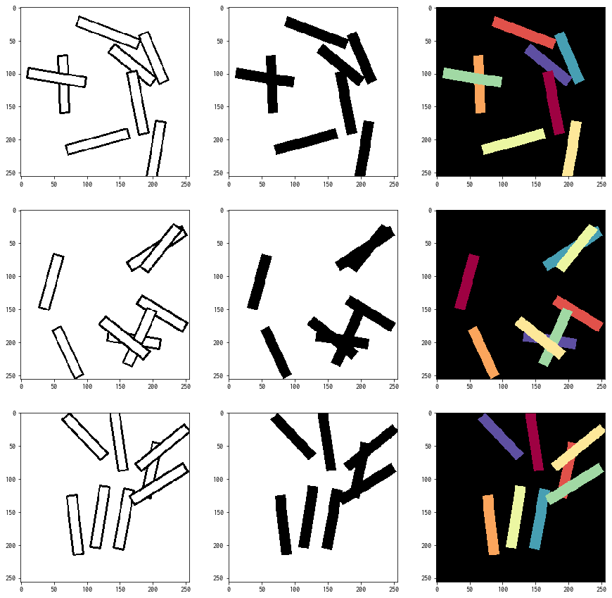

# pytorch-discriminative-loss
Implementation of discriminative loss for instance segmentation by pytorch

## Pretrained model
- Download model from [here](https://drive.google.com/drive/folders/1ihcqYr9PptELUZjHVL7jT4LXB3VpfxNt?usp=sharing) and save it in model/

## Environments
Ubuntu16.04  
python3.6.4  
pytorch: 0.3.1  
opencv: 3.3.1  

## Reference
https://arxiv.org/pdf/1802.05591.pdf  
https://github.com/Wizaron/instance-segmentation-pytorch  
https://github.com/milesial/Pytorch-UNet  
